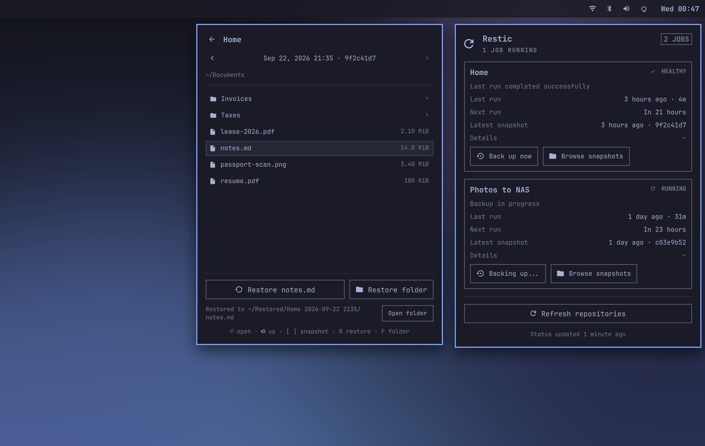

# Restic for Omarchy

A read-only Omarchy shell plugin for monitoring restic jobs, schedules, repository metadata, and optional integrity checks.

It tells you whether your backups are running.



## What it shows

- Overall health in the Omarchy bar and per-job status in the panel
- Last completed run, duration, and next timer run
- Latest snapshot and its backup summary when restic recorded one
- Snapshot count and raw-data statistics
- Repository reachability and cache freshness
- Optional integrity-check service health
- Redacted recent logs when a job needs attention

Health follows completed systemd runs, not snapshot age. This matters when a backup uses `--skip-if-unchanged`, because a successful unchanged run intentionally creates no snapshot. If no run history survives, the timer's last trigger time is used instead.

Repository statistics are supplementary. If snapshots can be read but the stats query fails, the job stays healthy and the card reports that statistics are unavailable.

## Safety boundary

The plugin is read-only. It runs only:

- `systemctl --user show`
- `systemctl --user list-unit-files`
- `journalctl --user`
- `restic snapshots --json`
- `restic stats --json --mode raw-data`

Discovery reads user unit files, referenced environment files, and local wrapper scripts as plain text. It never sources them.

Repository commands use normal restic locking and are deferred while the matching service is active. The lock protects the race if a job starts between checks. Successful metadata is cached for later display. After a failed refresh, the plugin waits one repository refresh interval before trying again, unless a refresh is forced. Cache directories use mode `0700`, cache files use mode `0600`, and restic gets a private cache directory under the plugin cache.

The plugin never uses `--no-lock`, reads password contents itself, starts jobs, prunes snapshots, unlocks repositories, or changes restic configuration.

## Requirements

- Omarchy 4 with shell plugin support
- Python 3
- restic
- Each monitored backup represented by a user systemd service and timer
- Repository and password files usable by restic

## Install

Install and enable the plugin:

```bash
omarchy plugin add https://github.com/orienw/omarchy-restic.git --enable
```

The plugin discovers restic jobs automatically. It lists user systemd timers, resolves each triggered service, and inspects static service metadata or a readable local wrapper script. Discovery recognizes `restic backup` jobs and extracts:

- The service and timer names
- `RESTIC_REPOSITORY_FILE`
- `RESTIC_PASSWORD_FILE`
- The restic executable when statically assigned
- The backup tag when present

Discovery never sources or executes a backup script. Direct restic commands and static shell assignments are supported. Dynamic command construction, repository URLs without repository files, and unusual credential loading need an override.

Discovered job identifiers come from the service unit name, so changing a unit description only changes the label. The last good discovery is cached. If timer discovery later fails, the existing cards remain visible while the panel reports that verification is degraded. If a single service cannot be inspected, its cached definition is reused the same way.

## Optional job overrides

If automatic discovery cannot fully describe a job, copy and edit the included override file:

```bash
install -Dm600 \
  ~/.config/omarchy/plugins/io.github.orienw.restic/config/jobs.example.json \
  ~/.config/omarchy-restic/jobs.json
```

When this file exists, its jobs are merged with automatic discovery by service name. A configured job replaces the discovered definition for the same service. Discovered services not mentioned in the file remain visible. Example:

```json
{
  "schemaVersion": 1,
  "jobs": [
    {
      "id": "home",
      "name": "Home",
      "service": "restic-backup.service",
      "timer": "restic-backup.timer",
      "repositoryFile": "~/.config/restic/repository",
      "passwordFile": "~/.config/restic/password",
      "tag": "forge",
      "maxRunAgeHours": 36
    }
  ]
}
```

Job fields:

| Field | Required | Purpose |
| --- | --- | --- |
| `id` | Yes | Stable lowercase identifier |
| `name` | No | Label shown in the panel |
| `service` | Yes | User systemd backup service |
| `timer` | Yes | User systemd schedule timer |
| `repositoryFile` | Yes | File containing the restic repository location |
| `passwordFile` | Yes | Restic repository password file |
| `restic` | No | Executable name or path, defaults to `restic` |
| `tag` | No | Restricts snapshots and stats to one restic tag |
| `maxRunAgeHours` | No | Successful-run deadline. Defaults to 36 hours or the observed timer interval plus 12 hours, whichever is larger |
| `checkService` | No | Existing user service that runs `restic check` |
| `checkTimer` | No | Timer for the integrity-check service |
| `checkMaxAgeHours` | No | Integrity-check deadline, defaults to 720 hours |

Paths expand `~` and environment variables. Backend credentials needed by restic must already be available to the Omarchy shell process. Their values are never returned in the status report.

## Controls

- Left click opens the details panel.
- Middle click refreshes status without forcing a repository query.
- Right click forces a read-only repository refresh.
- Press `R` in the panel to force a repository refresh.

## Update

```bash
omarchy plugin update io.github.orienw.restic
```

## Remove

```bash
omarchy plugin remove io.github.orienw.restic
```

Removal only removes the Omarchy shell integration. It does not stop or change backup services, timers, repositories, or the optional override file under `~/.config/omarchy-restic/`.

## Not included

Notifications and a guarded `Run now` action may come later. Repository creation, prune, unlock, retention editing, and restore are out of scope; use restic directly.
